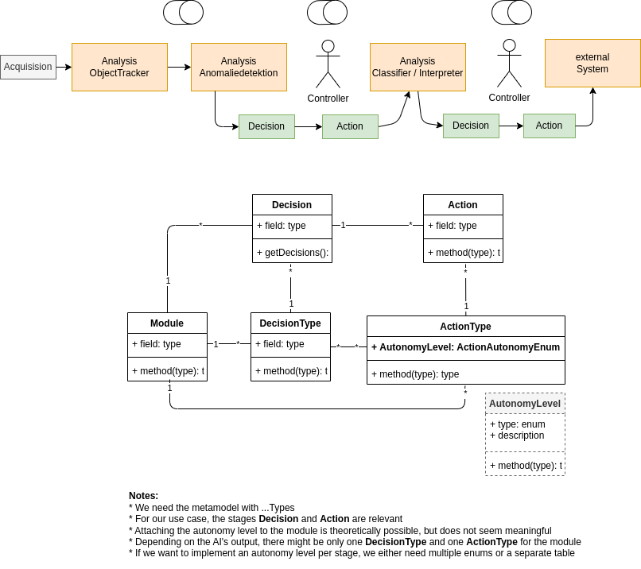

# Domain Model

## Requirements

We are using AI for doing business tasks. Further actions will be triggered dependent on the output of the AI-task. We are aware, that the decision the AI made is not perfect and mistakes occur. We have an operator to handle this.

Two user stories can be defined for operator:

### 1. Configure Automation Flow

As a AI-Operator I want to automate incident detection and incident handling as far as possible with the help of AI. I am aware that AI-decisions can be wrong. That's why I want to be able to monitor and interrupt automated processes as it seems to be needed.

**Acceptance Criterias:**

* decisions and informations about them are displayed
* actions can be configured dependent on decision
* decision-action mapping is saved in a way, that it can be used for futher decisions with the same type

### 2. Configure Level of Automation

As a AI-Operator want to switch between different automation levels in order to skip automation and check the decisions made by AI. Depending on criterias like criticality or amount of mistakes, I want to align the level of automation for the action based on AI-decisions. I want to set a lower level of automation, if decisions were wrong. I want to set a higher level of automation if no mistakes can be found.

**Acceptance Criterias:**

* level of automation can be switched on action level
* automation levels and detailed description of the behavior can be shown
* dependent tasks (not in scope): concrete behavior, interaction and automation has to be implemented for each autonomy level

### Important Design Alignment

We need a model of a non-trivial AI-output (e.g. classification) and a succeeding automation with more than one action:

## Generic Model

The first idea is, to implement different stages which can have a different set of autonomy levels which leads to a generic and highly configurable model.

**Stage** (Modul):

* In case it is a decision or action, it is a concrete event and needs to have a timestamp.

**StageType** (or Classification?):

* Something where we can define an autonomy level for. Stages with the same StageType has the same autonomy level (E.g. Unfall, Stau for Checkpoint decision).

**Level** (Autonomy Level):

Autonomy level configurable via database

**Checkpoint**:

* Acquisition, Analysis, Decision and Action
* The point where we want to check automation with autonomy levels
* Defines the possible autonomy levels per StageType.
* Alternative: Enums are a programmatic solution instead of levels and checkpoints. Hence, you cannot configure the possible autonomy per StageType

**Inherited classes decision and action**:

* Examples for Stages
* Might be we will not need them, but they are helpful
  * to add special attributes for different checkpoints (e.g. timestamp)
  * to save different Stages (Acquisition, Analysis, Decision, Action) in different database tables.

## Simplified Model

In fieldlab A, we are using only decisions and actions. So the question is, should we use a generic approach or a simpler one with concrete and known stages.

## Interface snippet

[interface snippet data types](https://github.com/KI-Cockpit/ai-cockpit-api/blob/main/configurationtypes.yaml)
